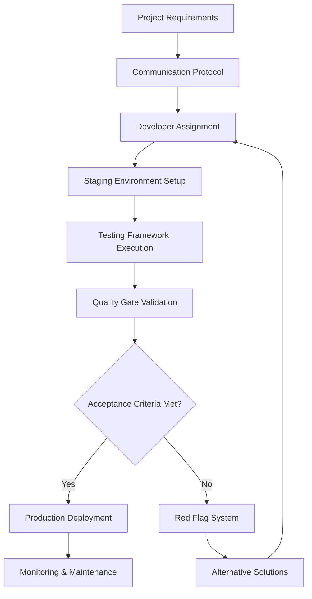

# Design Document

## Overview

The Website Quality Control Protocol System is a comprehensive framework designed to eliminate broken website features through systematic testing, clear developer communication, and strict accountability measures. The system transforms problematic developer relationships into professional, results-driven partnerships by providing standardized templates, testing procedures, and quality assurance protocols.

The system addresses the critical gap between client expectations and developer deliverables by establishing non-negotiable quality standards, providing specific communication tools, and creating accountability frameworks that ensure 100% functionality before acceptance. This approach eliminates the common issues of broken features, incomplete testing, and developer excuses through proactive quality control measures.

## Architecture

### System Components

The quality control system consists of five interconnected modules:

1. **Communication Protocol Engine** - Standardized templates and messaging systems
2. **Testing Framework** - Comprehensive testing procedures and tool integration
3. **Accountability Tracker** - Developer performance monitoring and requirement enforcement
4. **Quality Gate System** - Acceptance criteria validation and approval workflows
5. **Alternative Solution Manager** - Backup options and contingency planning

### Integration Points

The system integrates with existing project management workflows through:
- **Email Templates** - Pre-written communication scripts for immediate use
- **Testing Tool APIs** - Integration with GTmetrix, PageSpeed Insights, BrowserStack, and WAVE
- **Documentation Systems** - Requirement templates and acceptance criteria checklists
- **Monitoring Dashboards** - Performance tracking and quality metrics visualization

### Data Flow



## Components and Interfaces

### Communication Protocol Engine

**Interface: CommunicationProtocol**
```typescript
interface CommunicationProtocol {
  generateRequirementTemplate(feature: FeatureSpec): RequirementDocument
  createIssueReport(issue: IssueDetails): IssueReport
  generateTestingRequest(testScope: TestingScope): TestingRequest
  createEscalationMessage(redFlags: RedFlag[]): EscalationMessage
}
```

**Core Functions:**
- **Template Generation**: Creates standardized requirement documents with specific feature descriptions, user journeys, technical requirements, and acceptance criteria
- **Issue Reporting**: Transforms vague complaints into specific, actionable issue reports with error descriptions, expected behavior, and testing requirements
- **Testing Requests**: Generates detailed testing requirement messages demanding browser compatibility, device testing, and video proof
- **Escalation Management**: Creates professional escalation messages when developers fail to meet standards

### Testing Framework

**Interface: TestingFramework**
```typescript
interface TestingFramework {
  executeFunctionalityTests(website: WebsiteURL): FunctionalityReport
  performCrossBrowserTesting(testSuite: TestSuite): CompatibilityReport
  runPerformanceAnalysis(url: string): PerformanceMetrics
  validateAccessibility(webpage: WebPage): AccessibilityReport
  generateTestingChecklist(requirements: Requirements[]): TestingChecklist
}
```

**Testing Components:**
- **Functionality Validator**: Tests every clickable element, form submission, navigation, and interactive feature
- **Cross-Browser Engine**: Validates compatibility across Chrome, Firefox, Safari, and Edge using BrowserStack integration
- **Performance Monitor**: Measures loading speeds, optimization scores, and user experience metrics via GTmetrix and PageSpeed Insights
- **Accessibility Checker**: Ensures WCAG compliance using WAVE and other accessibility testing tools
- **Mobile Responsiveness Tester**: Validates functionality on actual mobile devices and various screen sizes

### Accountability Tracker

**Interface: AccountabilityTracker**
```typescript
interface AccountabilityTracker {
  trackDeveloperPerformance(developer: Developer): PerformanceMetrics
  validateStagingEnvironment(stagingURL: string): StagingValidation
  requireVideoProof(feature: Feature): VideoProofRequest
  monitorDeliveryStandards(deliverable: Deliverable): ComplianceReport
  detectRedFlags(developerBehavior: Behavior[]): RedFlagAlert[]
}
```

**Accountability Features:**
- **Performance Tracking**: Monitors developer delivery times, quality scores, and compliance rates
- **Staging Environment Validation**: Ensures developers provide working test environments before production deployment
- **Video Proof System**: Requires developers to demonstrate functionality through screen recordings
- **Delivery Standards Monitoring**: Tracks compliance with cross-browser compatibility, mobile responsiveness, and loading speed requirements
- **Red Flag Detection**: Identifies problematic developer behaviors and triggers alternative solution protocols

### Quality Gate System

**Interface: QualityGateSystem**
```typescript
interface QualityGateSystem {
  validateAcceptanceCriteria(deliverable: Deliverable): ValidationResult
  enforceQualityStandards(website: Website): QualityReport
  approveForProduction(testResults: TestResults[]): ApprovalDecision
  rejectWithFeedback(issues: Issue[]): RejectionReport
}
```

**Quality Gates:**
- **Functionality Gate**: 100% of requested features must work correctly
- **Performance Gate**: Page loading times must be under 3 seconds
- **Compatibility Gate**: Must work on Chrome, Firefox, Safari, and Edge
- **Mobile Gate**: Must function properly on phones and tablets
- **Error Handling Gate**: Must handle invalid inputs and error scenarios gracefully

### Alternative Solution Manager

**Interface: AlternativeSolutionManager**
```typescript
interface AlternativeSolutionManager {
  evaluateNoCodeOptions(requirements: Requirements): NoCodeRecommendation[]
  findAlternativeDevelopers(projectSpec: ProjectSpec): DeveloperOptions[]
  assessCostBenefit(solutions: Solution[]): CostBenefitAnalysis
  implementContingencyPlan(failedDeveloper: Developer): ContingencyPlan
}
```

**Alternative Solutions:**
- **No-Code Platforms**: Webflow for professional websites, Shopify for e-commerce, WordPress + Elementor for self-management
- **Developer Sourcing**: Upwork and Fiverr with detailed job requirements and quality testing procedures
- **Quality Assurance**: Small test project protocols for evaluating new developers
- **Cost-Benefit Analysis**: Comparison of alternatives based on cost, timeline, and quality expectations

## Data Models

### Project Requirements Model
```typescript
interface ProjectRequirements {
  featureName: string
  userJourney: UserJourneyStep[]
  technicalRequirements: TechnicalSpec[]
  testingCriteria: TestingCriteria
  acceptanceDefinition: AcceptanceDefinition
  timeline: ProjectTimeline
  qualityStandards: QualityStandard[]
}
```

### Developer Performance Model
```typescript
interface DeveloperPerformance {
  developerId: string
  deliveryHistory: DeliveryRecord[]
  qualityScores: QualityMetric[]
  communicationRating: CommunicationScore
  redFlagCount: number
  stagingEnvironmentCompliance: boolean
  videoProofCompliance: boolean
  crossBrowserTestingCompliance: boolean
}
```

### Testing Results Model
```typescript
interface TestingResults {
  functionalityTests: FunctionalityTestResult[]
  performanceMetrics: PerformanceMetric[]
  crossBrowserResults: BrowserCompatibilityResult[]
  accessibilityScore: AccessibilityScore
  mobileResponsivenessResults: MobileTestResult[]
  errorHandlingResults: ErrorHandlingResult[]
  overallQualityScore: number
}
```

### Quality Standards Model
```typescript
interface QualityStandards {
  functionalityRequirement: "100% working features"
  performanceRequirement: "Under 3 seconds loading time"
  browserCompatibility: ["Chrome", "Firefox", "Safari", "Edge"]
  mobileResponsiveness: "Functional on phones and tablets"
  errorHandling: "Proper error messages and graceful failures"
  stagingEnvironmentRequired: true
  videoProofRequired: true
  testingDocumentationRequired: true
}
```

## Correctness Properties

*A property is a characteristic or behavior that should hold true across all valid executions of a system-essentially, a formal statement about what the system should do. Properties serve as the bridge between human-readable specifications and machine-verifiable correctness guarantees.*

Now I need to use the prework tool to analyze the acceptance criteria before writing the correctness properties.

### Converting EARS to Properties

Based on the prework analysis, I've identified several key properties that can be consolidated to eliminate redundancy while maintaining comprehensive coverage:

**Property 1: Template Generation Completeness**
*For any* communication scenario or documentation requirement, the system should generate a complete, properly formatted template that includes all required sections and is immediately usable without modification
**Validates: Requirements 1.1, 1.3, 1.6, 9.1, 9.2, 9.3, 9.4, 9.5, 9.6**

**Property 2: Input Validation and Specificity Enforcement**
*For any* issue description or requirement input, the system should reject vague or incomplete information and only accept specific, actionable descriptions with measurable criteria
**Validates: Requirements 1.2, 1.4, 2.4, 4.3, 9.5**

**Property 3: Comprehensive Testing Coverage**
*For any* website or web application, the testing framework should identify and test all interactive elements, include all required browsers and devices, and cover all specified testing scenarios including error handling
**Validates: Requirements 2.1, 2.2, 2.3, 2.6, 2.7, 4.2, 4.4, 4.5**

**Property 4: Testing Tool Integration Completeness**
*For any* testing requirement, the system should provide integration with the appropriate free testing tools (GTmetrix, PageSpeed Insights, BrowserStack, WAVE, Google Search Console) along with step-by-step setup instructions requiring no technical knowledge
**Validates: Requirements 2.5, 5.1, 5.2, 5.3, 5.4, 5.5, 5.6**

**Property 5: Quality Threshold Enforcement**
*For any* deliverable evaluation, the system should enforce 100% functionality requirements, performance standards under 3 seconds, cross-browser compatibility, and mobile responsiveness on actual devices
**Validates: Requirements 4.1, 4.3, 4.6, 3.5**

**Property 6: Accountability Requirement Enforcement**
*For any* developer work submission, the system should require staging environment provision, video proof of functionality, written testing documentation, and cross-browser compatibility proof before allowing acceptance
**Validates: Requirements 3.1, 3.2, 3.3, 3.5, 3.6**

**Property 7: Red Flag Detection and Response**
*For any* developer behavior pattern, the system should detect problematic behaviors (refusing staging environments, making excuses, inadequate testing, unsubstantiated claims, premature payment requests) and trigger appropriate alternative action recommendations
**Validates: Requirements 6.1, 6.2, 6.3, 6.4, 6.5, 6.6**

**Property 8: Alternative Solution Recommendation**
*For any* project requirements or developer failure scenario, the system should provide appropriate alternative solutions (no-code platforms, e-commerce solutions, self-management options, new developer sourcing) with cost-benefit analysis
**Validates: Requirements 7.1, 7.2, 7.3, 7.4, 7.5, 7.6**

**Property 9: Implementation Guidance Completeness**
*For any* quality control implementation request, the system should provide a complete 24-hour action plan, timeline expectations, success metrics, communication scripts, and priority ordering
**Validates: Requirements 8.1, 8.2, 8.3, 8.4, 8.5, 8.6**

**Property 10: Performance Tracking and Monitoring**
*For any* developer or website being monitored, the system should track performance metrics over time, provide automated monitoring with alerts, include immediate response procedures, and maintain backup and recovery capabilities
**Validates: Requirements 3.4, 10.1, 10.2, 10.3, 10.4, 10.5, 10.6**

## Error Handling

The system implements comprehensive error handling across all components:

### Communication Protocol Errors
- **Invalid Template Requests**: System validates template parameters and provides specific error messages for missing or invalid inputs
- **Malformed Issue Reports**: System rejects vague descriptions and guides users to provide specific, actionable information
- **Communication Failures**: System provides escalation procedures and alternative communication channels when primary methods fail

### Testing Framework Errors
- **Tool Integration Failures**: System provides fallback testing procedures when external tools (GTmetrix, BrowserStack, etc.) are unavailable
- **Network Connectivity Issues**: System includes offline testing procedures and local validation methods
- **Browser Compatibility Failures**: System provides detailed error reporting and alternative testing approaches for unsupported browsers

### Accountability System Errors
- **Missing Staging Environments**: System blocks approval workflows and provides clear requirements for staging environment setup
- **Incomplete Documentation**: System validates required documentation completeness and provides templates for missing components
- **Performance Tracking Failures**: System maintains backup tracking methods and manual verification procedures

### Quality Gate Errors
- **Failed Acceptance Criteria**: System provides detailed failure reports with specific remediation steps
- **Performance Threshold Violations**: System generates comprehensive performance analysis with optimization recommendations
- **Accessibility Compliance Failures**: System provides detailed accessibility reports with specific fix instructions

### Data Integrity Protection
- **Backup and Recovery**: System maintains automated backups of all quality control data and provides rapid recovery procedures
- **Version Control**: System tracks all changes to requirements, testing procedures, and quality standards with full audit trails
- **Data Validation**: System validates all inputs and maintains data consistency across all components

## Testing Strategy

The Website Quality Control Protocol System employs a dual testing approach combining unit tests for specific functionality and property-based tests for universal correctness validation.

### Unit Testing Approach

**Specific Examples and Edge Cases:**
- **Template Generation**: Test specific communication scenarios (bug reports, feature requests, escalation messages) to ensure proper formatting and completeness
- **Tool Integration**: Test individual tool APIs (GTmetrix, PageSpeed Insights, BrowserStack, WAVE) with known inputs to verify correct data parsing and error handling
- **Red Flag Detection**: Test specific developer behavior patterns to ensure accurate detection and appropriate response triggering
- **Quality Gate Validation**: Test specific acceptance criteria scenarios to verify proper approval/rejection decisions

**Integration Testing:**
- **End-to-End Workflows**: Test complete quality control processes from requirement specification through final approval
- **Cross-Component Communication**: Verify proper data flow between communication protocols, testing frameworks, and accountability systems
- **External Tool Integration**: Test real-world integration with third-party testing tools and services
- **Error Recovery**: Test system behavior during tool failures, network issues, and data corruption scenarios

### Property-Based Testing Configuration

**Testing Framework**: Jest with fast-check for JavaScript/TypeScript implementation
**Minimum Iterations**: 100 iterations per property test to ensure comprehensive input coverage
**Test Tagging Format**: Each property test includes comment: `// Feature: website-quality-control, Property {number}: {property_text}`

**Property Test Focus Areas:**
- **Universal Template Generation**: Verify all communication scenarios produce valid, complete templates
- **Comprehensive Testing Coverage**: Ensure all website elements are identified and tested regardless of site structure
- **Quality Threshold Enforcement**: Validate rejection of any deliverable not meeting 100% functionality standards
- **Accountability Requirement Validation**: Ensure all developer submissions are properly validated for required documentation and proof
- **Red Flag Detection Accuracy**: Verify problematic behaviors are consistently detected across various developer interaction patterns

**Randomization Strategy:**
- **Website Structure Generation**: Create random website structures with varying complexity, element types, and interaction patterns
- **Developer Behavior Simulation**: Generate random developer response patterns including both compliant and problematic behaviors
- **Requirement Specification Variation**: Test with randomly generated project requirements of varying complexity and scope
- **Performance Metric Simulation**: Generate random performance data to test threshold enforcement and quality gate validation

**Property Test Implementation Requirements:**
- Each correctness property must be implemented as a single property-based test
- Tests must reference their corresponding design document property number
- All property tests must validate universal behaviors across randomized inputs
- Property tests complement unit tests by providing comprehensive input coverage validation

The testing strategy ensures both concrete functionality validation through unit tests and universal correctness verification through property-based testing, providing comprehensive quality assurance for the quality control system itself.